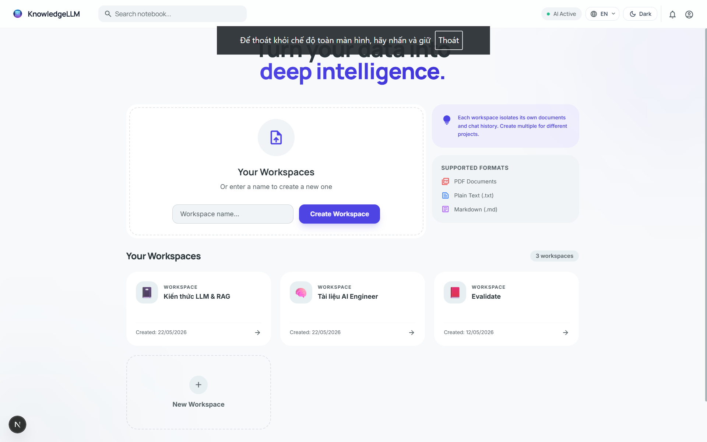
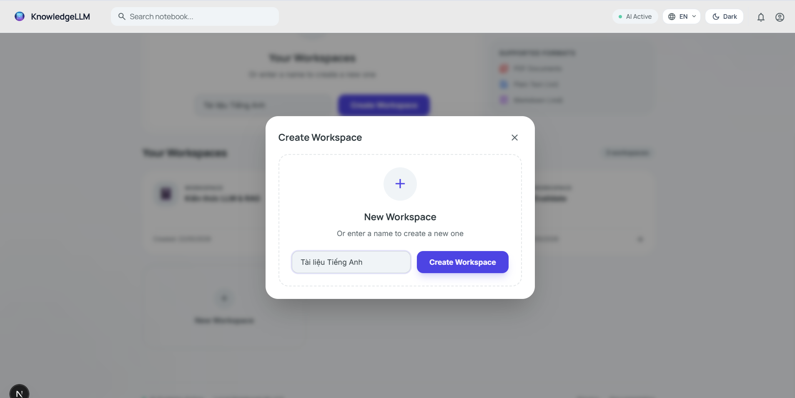
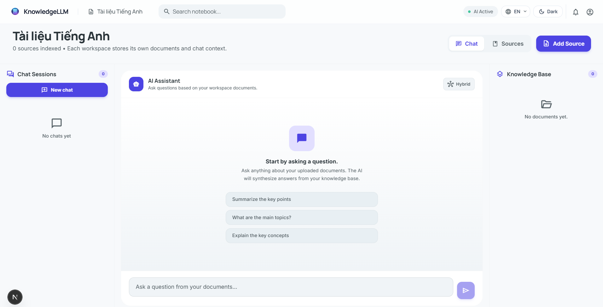
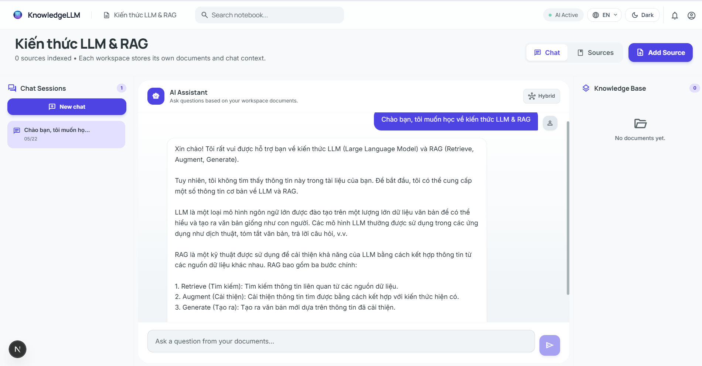
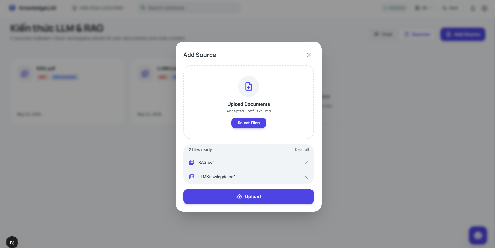
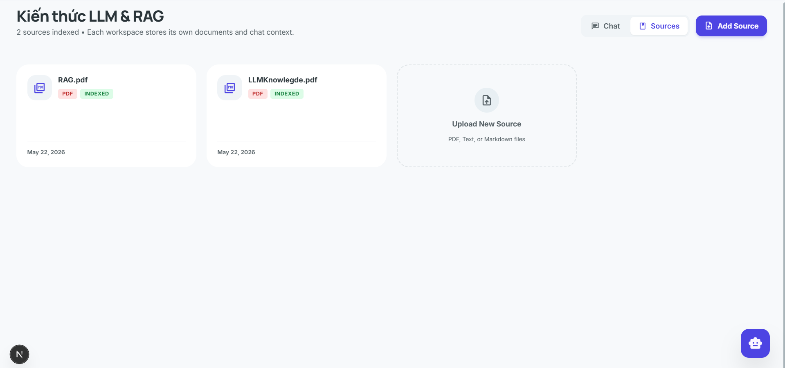
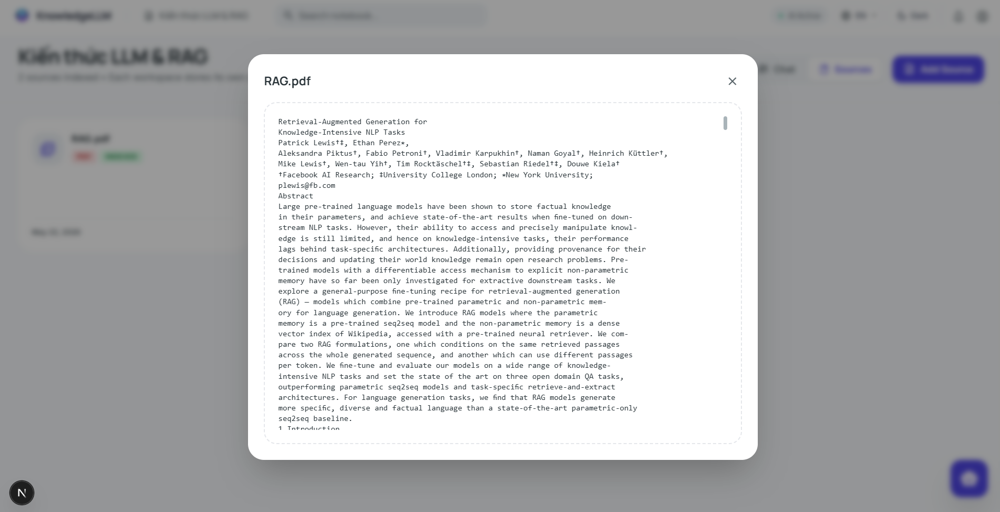
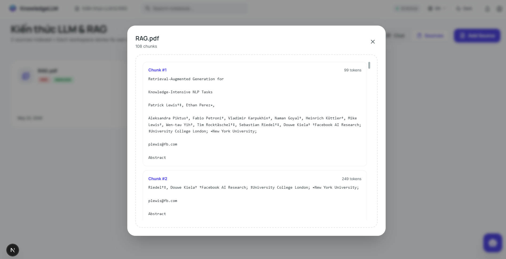
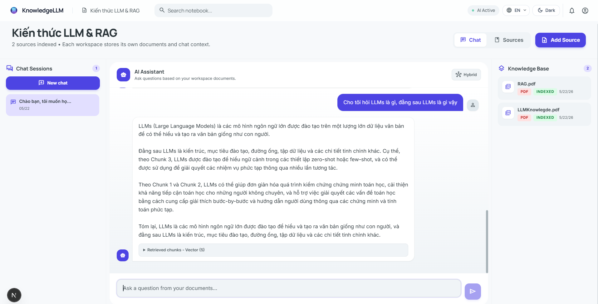
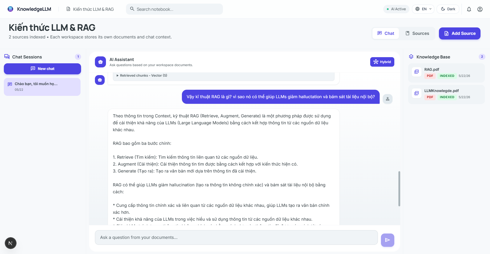

# Local NotebookLM

Local NotebookLM is a self-hosted document Q&A app inspired by NotebookLM. It lets you create workspaces, upload PDF/TXT/MD sources, index document chunks into Supabase Postgres + pgvector, and chat with your own knowledge base through a RAG pipeline.



## Highlights

- Workspace-based knowledge management.
- Multi-file upload for `.pdf`, `.txt`, and `.md`.
- Background ingest pipeline with parse status: `pending`, `processing`, `done`, `failed`.
- Document actions: view content, view chunks, rename, delete, and rechunk failed files.
- Persistent chat sessions and chat history per workspace.
- RAG search modes: vector similarity, BM25 lexical search, and hybrid search.
- Supabase Postgres schema with `pgvector`, HNSW index, and BM25 helper tables.
- Clean split between Next.js frontend and FastAPI backend.

## Demo

### Workspace Flow

Create and manage workspaces from the home page.





### Chat Sessions

Each workspace can keep multiple chat sessions.



### Source Upload

Add sources through the workspace modal, then track indexed documents in the Sources view.





### Document Inspection

Inspect parsed raw text and generated chunks directly from the UI.





### RAG Chat

Ask questions against uploaded sources and review answers with retrieved context.





## Tech Stack

| Layer | Libraries / Tools |
| --- | --- |
| Frontend | Next.js `15.2.4`, React `19.0.0`, TypeScript `5.8.2`, Tailwind CSS `3.4.17` |
| Backend API | FastAPI `0.116.1`, Uvicorn `0.35.0`, Pydantic `2.11.7` |
| Database | Supabase, PostgreSQL, `asyncpg`, `psycopg`, `pgvector` |
| Document parsing | `pypdf`, TXT/Markdown parser, optional external PDF parser API |
| Chunking | `langchain-text-splitters`, `tiktoken` |
| Retrieval | pgvector cosine similarity, BM25 lexical search, hybrid search |
| External services | LLM API endpoint, embedding API endpoint, optional OpenRouter embedding settings |

## Architecture

```txt
Browser
  |
  v
Next.js Frontend
  - app router pages
  - reusable React components
  - typed fetch client in frontend/lib/api.ts
  |
  v
FastAPI Backend
  - /upload: receive files and start ingest
  - /documents: workspaces, files, content, chunks
  - /chat: sessions, messages, RAG answers
  |
  v
Supabase Postgres + pgvector
  - workspaces
  - files
  - chunks
  - chat_sessions
  - chat_messages
  - vector and lexical indexes
  |
  v
External AI Services
  - embedding API
  - LLM API
```

## Repository Structure

```txt
local_notebooklm/
├── backend/
│   ├── main.py                  # FastAPI entry point
│   ├── config.py                # Environment config loader
│   ├── database.py              # Database pool/client setup
│   ├── routers/                 # API route modules
│   ├── services/                # Ingest, parsing, embeddings, vector store, LLM client
│   ├── models/                  # Pydantic request/response models
│   ├── data/uploads/.gitkeep    # Local temporary upload folder
│   └── requirements.txt
├── frontend/
│   ├── app/                     # Next.js App Router pages
│   ├── components/              # UI components
│   ├── lib/                     # API client and UI helpers
│   ├── public/                  # Runtime static assets
│   └── package.json
├── docs/
│   └── images/features/         # README demo screenshots
├── supabase_migration.sql       # One-shot Supabase schema migration
├── .env.example                 # Backend/root environment template
├── .gitignore
└── README.md
```

## Requirements

- Node.js 20 LTS or newer.
- Python 3.10 or newer.
- npm.
- Supabase project with Postgres extensions enabled by `supabase_migration.sql`.
- Running LLM API and embedding API endpoints.

## Environment Variables

Create a root `.env` from `.env.example`.

```env
SUPABASE_URL=
SUPABASE_ANON_KEY=
SUPABASE_SERVICE_ROLE_KEY=
DATABASE_URL=

LLM_API_URL=http://127.0.0.1:8001
LLM_API_KEY=

EMBEDDING_API_URL=
EMBEDDING_DIM=1024
EMBED_MODEL=BAAI/bge-m3

OPENROUTER_API_KEY=
OPENROUTER_SITE_URL=
OPENROUTER_SITE_NAME=

PDF_PARSE_API_URL=

CHUNK_SIZE=1024
CHUNK_OVERLAP=128
```

For the frontend, create `frontend/.env.local`:

```env
NEXT_PUBLIC_BACKEND_URL=http://127.0.0.1:8000
```

Never commit `.env`, `.env.local`, API keys, database URLs, or Supabase service role keys.

## Database Setup

Run the SQL file once in the Supabase SQL Editor:

```txt
supabase_migration.sql
```

The migration creates workspace, file, chunk, BM25 term, and chat tables. It also enables `vector` and `pg_trgm`, then creates vector search functions and indexes.

## Quick Start

Clone the repository:

```bash
git clone https://github.com/HuyNguyenTheDev/local_notebooklm.git
cd local_notebooklm
```

Install backend dependencies:

```bash
python -m venv .venv
```

Windows PowerShell:

```powershell
.\.venv\Scripts\Activate.ps1
pip install --upgrade pip
pip install -r backend/requirements.txt
```

macOS/Linux:

```bash
source .venv/bin/activate
pip install --upgrade pip
pip install -r backend/requirements.txt
```

Start the backend from the repository root:

```bash
uvicorn backend.main:app --reload --host 127.0.0.1 --port 8000
```

Install and run the frontend:

```bash
cd frontend
npm install
npm run dev
```

Open the app:

```txt
http://localhost:3000
```

Backend docs:

```txt
http://127.0.0.1:8000/docs
http://127.0.0.1:8000/redoc
```

## Main API

| Endpoint | Method | Purpose |
| --- | --- | --- |
| `/` | GET | Health check |
| `/upload` | POST | Upload one or more files and start background ingest |
| `/documents/workspaces` | GET | List workspaces |
| `/documents/workspaces` | POST | Create workspace |
| `/documents/workspaces/search` | GET | Search workspaces |
| `/documents/workspace/{workspace_id}` | DELETE | Delete workspace |
| `/documents?workspace_id=...` | GET | List workspace documents |
| `/documents/{file_id}` | GET | Read parsed document content |
| `/documents/{file_id}/chunks` | GET | List generated chunks |
| `/documents/{file_id}/rechunk` | POST | Retry chunking/embedding |
| `/documents/{file_id}` | PATCH | Rename document |
| `/documents/{file_id}` | DELETE | Delete document |
| `/chat/sessions` | GET | List chat sessions |
| `/chat/sessions` | POST | Create chat session |
| `/chat/sessions/{session_id}/messages` | GET | Read chat messages |
| `/chat/sessions/{session_id}` | PATCH | Rename chat session |
| `/chat/sessions/{session_id}` | DELETE | Delete chat session |
| `/chat` | POST | Ask a RAG question |

## Usage Flow

1. Create a workspace from the home page.
2. Open the workspace and click `Add Source`.
3. Upload PDF/TXT/MD files.
4. Wait for the source status to become `Indexed`.
5. Inspect content or chunks from the Sources view if needed.
6. Ask questions in Chat.
7. Use Hybrid mode when you want vector search plus lexical matching.

## Development Commands

Backend:

```bash
uvicorn backend.main:app --reload --host 127.0.0.1 --port 8000
```

Frontend:

```bash
cd frontend
npm run dev
```

Production frontend build:

```bash
cd frontend
npm run build
npm start
```

## Git Hygiene

The repo is configured to ignore local secrets, virtual environments, build outputs, logs, and uploaded runtime files. Demo screenshots belong in:

```txt
docs/images/features/
```

Runtime app images that the frontend serves directly belong in:

```txt
frontend/public/
```

## Troubleshooting

If the backend cannot connect to Supabase, check `DATABASE_URL`, `SUPABASE_URL`, and `SUPABASE_SERVICE_ROLE_KEY`.

If chat fails, verify that `LLM_API_URL` is reachable and that the external LLM server is running.

If retrieval fails, verify that `EMBEDDING_API_URL`, `EMBEDDING_DIM`, and `EMBED_MODEL` match your embedding service and database schema.

If PDF parsing returns empty text, use PDFs with a text layer or configure `PDF_PARSE_API_URL` for OCR/parser fallback.

## Project Status

Version: `2.0.0`

This project is currently designed for local development and educational RAG experiments. For production, add authentication, stricter CORS, request rate limits, observability, backup jobs, and secret rotation procedures.